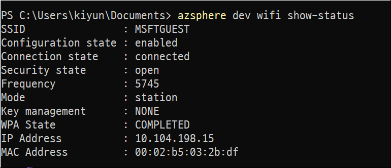

# Option Lab : Azure IoT Hub 에 연결하기

- [Home Page](README.md) 로 돌아가기

## 목적
- Azure Sphere 에 Wi-Fi 네트워크 설정하는 것을 익힐 수 있습니다.
- Azure IoT Hub 설정을 익힐 수 있습니다.
- Azure Sphere device 가 어떻게 Azure IoT Hub & DPS 를 통해 등록되는지 이해할 수 있습니다.
- Device Twin 과 Azure IoT Hub Device to message Azure 를 이해할 수 있습니다. 
- Azure IoT C device SDK API 의 기본사용에 익숙해질 수 있습니다.

## 단계

1. [Setup IoT Hub](https://docs.microsoft.com/ko-kr/azure-sphere/app-development/setup-iot-hub) 페이지에 따라 아래의 절차대로 클라우드 자원을 설정합니다.     
    - [Azure IoT Hub 와 DPS(Device Provisioning Service)를 생성](https://docs.microsoft.com/ko-kr/azure/iot-dps/quick-setup-auto-provision)하고 서로 연결합니다.
    - [Tenant CA 인증서를 DPS에 업로드하고 검증절차](https://docs.microsoft.com/ko-kr/azure-sphere/app-development/setup-iot-hub#step-2-download-the-tenant-authentication-ca-certificate)를 완료합니다.
    - Azure Sphere 디바이스를 등록하기 위해 DPS에 Enrollment 그룹을 추가합니다.

    > ~~- Azure IoT Hub DPS 서비스는 무료구독으로 사용할 수 없습니다. 실습에서는 Pay-as-you-go 구독으로 사용합니다.~~

2. Azure Sphere 개발보드를 PC에 연결하고 Azure Sphere utility 에서 디바이스를 디버그 모드로 전환합니다. (OTA는 비활성화됨)    
   `azsphere device enable-development`

3. 아래의 절차대로 Wi-Fi credential 이 설정되었는지 확인하고 Azure Sphere 를 AP에 연결합니다.

- Wi-Fi SSID 와 패스워드를 설정하고 Azure Sphere 디바이스를 Azure Sphere 보안 서비스에 연결하도록 합니다.   
   `azsphere device wifi add --ssid <yourSSID> --psk <yourNetworkKey>`
   
   > - 보안설정이 없는 Wi-Fi 네트워크 연결에서는 --psk 플래그를 생략합니다.
   > - 만약 SSID 나 패스워드에 스페이스가 있는 경우는 " "처리 합니다. e.g. --ssid "My iPhone"

-  아래의 커맨드로 AP에 연결되었는지 Wi-Fi 상태를 확인할 수 있습니다.
   
   `azsphere device wifi show-status`

    

4. Visual Studio 를 실행하여 `File - Open - CMake...` 를 차례로 클릭합니다.
   `.\azure-sphere-samples\Samples\AzureIoT` 폴더를 선택 후 CMakeLists.txt 를 선택합니다.

   

   프로젝트를 빌드하기 전에 3가지 필수 정보를 *app_manifest.json* 파일에 입력을 해줍니다.

   1. Azure Sphere 디바이스의 Tenant ID
   2. Device Provisioning Service(DPS) 인스턴스의 Scope ID
   3. 내 Azure IoT Hub 의 URL 주소
   
   
   
   해당 [링크](https://github.com/Azure/azure-sphere-samples/blob/master/Samples/AzureIoT/IoTHub.md#configure-the-sample-application-to-work-with-your-azure-iot-hub) 에서 위 정보들을 어떻게 얻는지 확인할 수 있습니다.

     > **중요!** 기존에 있던 **AllowedConnections** 의 DPS global endpoint: *global.azure-devices-provisioning.net* 를 **지우면 안됩니다**

5. **F5** 를 눌러 빌드 후 어플리케이션을 로드하면 디바이스가 IoT Hub에 성공적으로 연결된 후 가상의 원격 데이터를 보내는 것을 Output log창을 통해 확인할 수 있습니다.
   
   

    > Azure IoT Hub 는 수백만의 IoT 디바이스와 클라우드 솔루션 사이의 안정적인 양방향 보안 통신을 위한 핵심의 PaaS 
    솔루션입니다.
    사용자를 위한 서비스 API 연결을 통해 데이터 분석을 위한 비즈니스 백엔드, 저장소, 시각화 등을 구현할 수 있게 합니다.
    이 실습에서 **Device Explorer** 라는 툴을 사용하여 가상의 사용자 어플리케이션으로 데이터 확인과 IoT 디바이스 제어를 할 수 있습니다.

6. [DeviceExplorer.msi](https://github.com/Azure/azure-iot-sdk-csharp/releases/download/2019-1-4/SetupDeviceExplorer.msi)을 다운로드하고 설치합니다.

7. 내 IoT Hub 포탈로 갑니다. Policy 항목에서 iothubowner 의 **shared access policies** 설정에서 connection string을 확인합니다. 해당 아이콘을 클릭하여 복사합니다.

   

8. *DevcieExplorer** 를 실행 후 Configuration 탭의 입력 창에 Connection string 을 붙여넣기 합니다. **update** 를 눌러 IoT Hub에 연결합니다. 
   
   

9. *Data* 탭으로 이동하여, 해당 디바이스 ID를 선택 후  **Update** 버튼을 클릭하여 디바이스에서 오는 D2C(Device to Cloud) 메세지를 확인합니다.
   
   

10. 이번 실습에서 Cloud to Device(C2D) 제어는 Device Twin 방식을 통해 구현되었습니다. *Management* 탭으로 이동하여 디바이스를 선택 후 **Twin Props** 버튼을 클릭하면 Device Twin 창이 나타납니다.

    

11. Device Twin 창에서 `"desired"` 속성 아래에 `"StatusLED":{"value":true}` 속성을 추가하고, **Send (use Json format)** 버튼을 눌러 Device Twin을 업데이트합니다. 해당 디바이스는 이 속성 값 변경이 알려지고 보드는 이에따라 LED1 을 켭니다.

   

## 도전

나만의 속성값을 Device Twin에 추가하고, 이것을 통해 LED의 BLUE 색상을 ON/OFF 해봅니다.

> MT3620 RDB의 경우 LED2 의 BLUE 색상은 **GPIO17**에 연결되어 있고, *SAMPLE_RGBLED_BLUE* 로 하드웨어 정의 파일에 정의되어 있습니다.

> Starter Kit의 경우 USER LED의 BLUE 색상은 **GPIO10** 에 연결되어 있고, *$MT3620_RDB_LED1_BLUE* 으로 manifest 파일에 추가할 수도 있습니다.

> Visual Studio 의 Cloud Explorer 를 통해서 D2C message 를 모니터링 해봅니다.

> Direct Method Call 을 적용해봅니다. 어려우면 Hint 를 사용합니다.

> Visual Studio 의 Cloud Explorer 를 통해서 Invoke Direct Method 를 해봅니다.
 

## 더 보기
- [Azure Sphere Application Manifest](https://docs.microsoft.com/ko-kr/azure-sphere/app-development/app-manifest)
- [Provisioning device with Azure IoT Hub DPS](https://docs.microsoft.com/ko-kr/azure/iot-dps/about-iot-dps)
- [IoT Hub D2C message](https://docs.microsoft.com/ko-kr/azure/iot-hub/iot-hub-devguide-messages-d2c)
- [IoT Hub Device Twin](https://docs.microsoft.com/ko-kr/azure/iot-hub/iot-hub-devguide-device-twins)
- [Azure IoT C SDK](https://github.com/Azure/azure-iot-sdk-c)